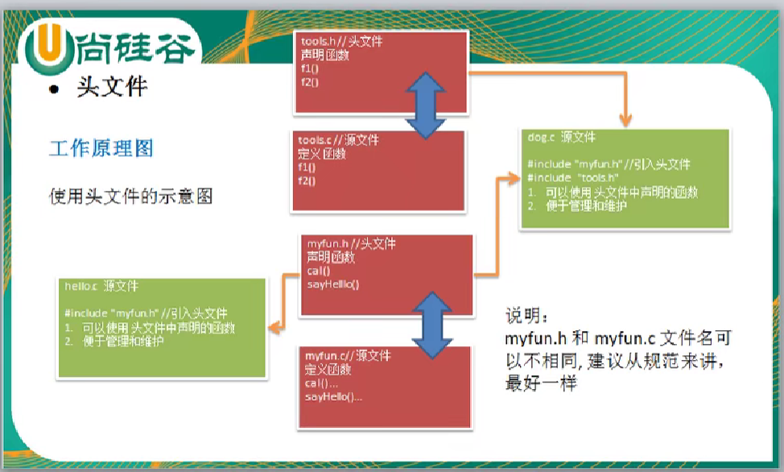

# C语言学习

## 一、头文件

###  需求：

在实际的开发中，我们往往需要在不同的文件中，去调用其他文件的定义的函数，比如 **hello.c** 中，去使用 **myfuns.c** 文件中的函数，如何实现？

<!--more-->

### 头文件基本概念

1. 头文件事扩展名为 **.h** 的文件，包含了C函数声明和宏定义，被多个源文件中引用共享。有两种类型的头文件：自己编写的头文件和C标准库自带的头文件。
2. 在程序中要使用头文件，需要使用C预处理指令 **#include** 来引用它。比如 **stdio.h** 头文件。
3. **#include** 叫做文件包含命令，用来引入对应的头文件 **.h文件** 。   **#include**  也是 C语言 **预处理命令** 的一种。
4. **#include** 的处理过程很简单，就是将头文件的内容插入到该命令所在的位置，从而把头文件和当前源文件连接成一个源文件，这与复制粘贴的效果相同。但是我们不会直接在源文件中复制头文件的内容，因为这么做容易出错，特别在程序是由多个源文件组成的时候。
5. 建议把所以的**常量**、**宏**、**系统全局变量**和**函数原型**写在头文件中，在需要的时候随时引用这些头文件。

### 工作原理

使用头文件示意图



> ***注意点***：在 Visual Studio 中，C 语言文件（.c）可以调用另一个 C 语言文件中的函数，即使没有包含相应的头文件（.h）。这是因为 Visual Studio 默认会在全局符号表中包含所有编译过的源文件的符号。
>
> 当你在一个 C 语言文件中定义函数时，该函数的符号将被添加到全局符号表中。如果你在另一个 C 语言文件中调用该函数，Visual Studio 将在全局符号表中查找该函数符号，并链接到正确的函数实现。
>
> 然而，这种做法并不推荐，因为它可能导致名称冲突和其他问题。最佳实践是使用头文件来声明函数和变量，并在需要时包含相应的头文件。这样可以确保在不同源文件之间正确地共享函数和变量定义，并提高代码的可读性和可维护性。

**myfuns.c**

```c
#include <stdio.h>
//实现函数
void sayHello() {
	printf("hello C");
}

```

**myfuns.h**

```c
//声明函数
void sayHello();
```

**hello.c**

```c
#include<stdio.h>
#include "myfuns.h"
void main() {
	sayHello();
}
```


### 注意事项和细节说明

1. 引用头文件相当于复制头文件的内容

   ```c
   #include "myfuns.h" 这句代码相当于将其内容复制过来
   	||
   //声明函数
   void sayHello();
   ```

2. 源文件的名字可以不和头文件一样，但是为了好管理，一般头文件名和源文件名一样。

3. C语言中 **include<>** 与 **include""** 的区别

   - include<>:
